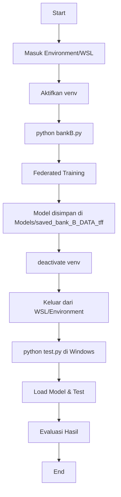

# 🏦 Bank B - Corporate Banking Fraud Detection

## 📋 Deskripsi Bank B

**Bank B** merupakan **"Bank Korporat Besar"** dengan karakteristik sebagai berikut:

### Karakteristik Transaksi
- 📊 **Volume Transaksi**: Lebih rendah dibandingkan dengan bank retail
- 💰 **Nilai Rata-rata**: Sangat tinggi - transaksi bernilai besar
- 🌍 **Jenis Transaksi**: Dominan transaksi **International** 
- 🏢 **Kategori**: Banyak transaksi **Services** dan **B2B (Business-to-Business)**

### Pola Penipuan
> [!CAUTION]
> **Pola Penipuan Lokal Bank B**: Penipuan biasanya berupa **satu transaksi internasional bernilai sangat besar**.

Karakteristik ini membedakan pola fraud Bank B dari bank retail - alih-alih banyak transaksi kecil yang mencurigakan, fraud detection pada Bank B fokus pada **deteksi anomali pada transaksi individual bernilai tinggi**.

---

## 🚀 Cara Menjalankan

### Prasyarat
- Python 3.11+ dengan virtual environment
- WSL (Windows Subsystem for Linux) atau environment Linux/Unix
- TensorFlow Federated (TFF) terinstal di dalam virtual environment

### Tahapan Eksekusi

#### 1. **Masuk ke Environment & Training Model**
```bash
# Aktifkan virtual environment (di dalam WSL atau terminal)
source venv/bin/activate  # Linux/WSL
# atau
.\venv\Scripts\activate   # Windows PowerShell

# Jalankan training federated learning
python bankB.py
```

**Proses yang terjadi**:
- Model akan melakukan federated learning menggunakan TensorFlow Federated (TFF)
- Data training diambil dari folder `data/`
- Fitur global dimuat dari `models_global/fitur_global.pkl`
- Training dilakukan dengan weighted Federated Averaging
- Model dan metadata disimpan ke folder `Models\saved_bank_B_DATA_tff`

#### 2. **Keluar dari Environment**
```bash
# Deaktivasi virtual environment
deactivate
```

#### 3. **Testing Model (di luar WSL/environment)**
```bash
# Kembali ke terminal/PowerShell Windows biasa (keluar dari WSL)
# Jalankan script testing
python test.py
```

**Proses yang terjadi**:
- Model yang telah dilatih akan diuji dengan data global
- Hasil evaluasi ditampilkan (accuracy, precision, recall, F1-score)
- Confusion matrix dibuat untuk analisis detail
- Hasil testing dicatat dalam file log

---

## 📦 Isi Folder `Models\saved_bank_B_DATA_tff`

Folder ini berisi hasil training model Bank B dengan struktur sebagai berikut:

### File-file Utama

| File/Folder | Deskripsi |
|------------|-----------|
| **saved_model.pb** | Model TensorFlow dalam format Protocol Buffer - arsitektur dan graph komputasi model |
| **keras_metadata.pb** | Metadata dari model Keras (arsitektur layer, konfigurasi, dll) |
| **fingerprint.pb** | Fingerprint unik untuk versioning model |
| **variables/** | Direktori berisi bobot (weights) dan bias dari model neural network |
| **assets/** | Asset tambahan yang mungkin diperlukan model (jika ada) |

### File Training Logs & History

| File | Deskripsi |
|------|-----------|
| **`YYYYMMDD_HHMMSS.npz`** | Snapshot bobot model dengan timestamp (format: NumPy compressed array) - memungkinkan rollback ke versi tertentu |
| **accuracy_history.txt** | Log akurasi per round/epoch dalam format teks |
| **history_bank_B_DATA.json** | Riwayat lengkap training dalam format JSON (loss, accuracy, metrics per round) |
| **best_accuracy.txt** | Akurasi terbaik yang pernah dicapai model (saat ini disabled/tidak digunakan) |

### File Preprocessing

| File | Deskripsi |
|------|-----------|
| **preprocess_bank_B_DATA.pkl** | Metadata preprocessing (scaler, encoder, kolom fitur, dll) - **PENTING** untuk inference agar data test diproses sama persis dengan data training |

---

## 🔍 Penjelasan Detail Komponen Model

### 1. **Model TensorFlow (saved_model.pb + variables/)**
Model neural network yang telah dilatih menggunakan Federated Learning. Dapat langsung dimuat dengan:
```python
import tensorflow as tf
model = tf.keras.models.load_model('Models/saved_bank_B_DATA_tff')
```

### 2. **Preprocessing Metadata (preprocess_bank_B_DATA.pkl)**
Berisi informasi tentang:
- Daftar fitur yang digunakan
- Scaler/normalisasi yang diterapkan
- Encoding untuk fitur kategorikal
- Dimensi fitur final

**Sangat penting** untuk memastikan konsistensi antara training dan testing.

### 3. **History & Logs**
- **JSON History**: Tracking metrik per round untuk analisis performa
- **NPZ Weights**: Snapshot bobot memungkinkan recovery atau analisis evolusi model
- **Accuracy History**: Quick reference untuk melihat trend akurasi

---

## 📊 Workflow Summary



---

## 📝 Catatan Penting

- Model menggunakan **Federated Learning** dengan weighted averaging
- Data client di-split berdasarkan parameter `n_clients`
- Setiap training akan membuat snapshot baru dengan timestamp
- File `best_accuracy.txt` saat ini **DISABLED** (tidak digunakan untuk sementara)
- Testing dilakukan di luar environment untuk memastikan model portabel

---

## 🛠️ Troubleshooting

### Error saat menjalankan bankB.py
- Pastikan virtual environment sudah diaktifkan
- Cek ketersediaan file data di `data/`
- Pastikan `models_global/fitur_global.pkl` tersedia

### Error saat menjalankan test.py
- Pastikan model sudah ditraining dan tersimpan di `Models\saved_bank_B_DATA_tff`
- Cek path file model sesuai dengan konfigurasi
- Pastikan preprocessing metadata (`preprocess_bank_B_DATA.pkl`) tersedia

---

**Last Updated**: Januari 2026
