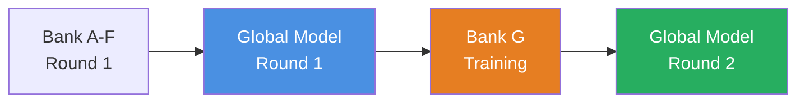

# 🏦 Bank G - BUMN Legacy Bank (Federated Learning Round 2)

## 📋 Deskripsi Umum

**Bank G** merupakan bank BUMN (Badan Usaha Milik Negara) dengan sistem warisan yang merupakan bagian dari **Federated Learning Iterasi ke-2**. Bank ini melanjutkan pembelajaran dari model global yang telah dilatih pada **Round 1** (aggregasi dari Bank A-F).

## ⚠️ Karakteristik & Tantangan Bank G

### 🏛️ **Legacy System Issues**

Bank G menggunakan sistem warisan (legacy) yang memiliki beberapa tantangan teknis:

#### 1. **Skema Data Berbeda**
Bank G memiliki skema database yang berbeda dari standar:
- ❌ **`transaction_value`** digunakan sebagai pengganti `amount`
- ❌ **`merchant_type`** digunakan sebagai pengganti `merchant_category`

#### 2. **Data Quality Issues (Dirty Data)**
Data dari Bank G mengandung berbagai masalah kualitas:

| **Masalah** | **Deskripsi** | **Kolom Terdampak** |
|-------------|---------------|---------------------|
| 🔴 **Missing Values** | Nilai hilang (NaN) | `location` |
| 🔴 **Corrupted Text** | Data amount masuk sebagai teks rusak | `amount` / `transaction_value` |

> [!IMPORTANT]
> **Data Preprocessing** sangat penting untuk Bank G karena kondisi data yang kotor. File [`bankG.py`](bankG.py) sudah dilengkapi dengan fungsi pembersihan data khusus (`clean_numeric`) untuk menangani masalah ini.

---

## 🌐 Federated Learning Round 2

Bank G melatih model lokal dengan memanfaatkan pengetahuan dari **Global Model Round 1** yang telah di-agregasi dari Bank A hingga Bank F.



### 📂 Model Global Round 1
Model global dari iterasi pertama tersimpan di:
```
models_global_round1/global_savedmodel/
```

Model ini digunakan sebagai **base initialization** untuk melatih model Bank G.

---

## 🚀 Cara Menjalankan

### 📌 **Prasyarat**
- Python 3.11
- Virtual environment sudah disiapkan (`venv/`)
- Dependencies terinstall (TensorFlow Federated, Pandas, NumPy, dll.)

---

### 📝 **Tahapan Eksekusi**

#### **Step 1: Aktivasi Environment & Training Model**

> [!TIP]
> Jika menggunakan **WSL (Windows Subsystem for Linux)**, pastikan environment WSL sudah aktif sebelum menjalankan script.

```bash
# Masuk ke environment (WSL atau venv lokal)
source venv/bin/activate  # Linux/WSL
# ATAU
venv\Scripts\activate     # Windows CMD/PowerShell

# Jalankan training Bank G
python bankG.py
```

**Output:**
- Model lokal Bank G akan dilatih menggunakan TensorFlow Federated
- Base model dimulai dari Global Model Round 1
- Proses training meliputi federated averaging dengan multiple clients

#### **Step 2: Keluar dari Environment**

```bash
# Deactivate environment
deactivate

# Jika menggunakan WSL, keluar dari WSL
exit
```

#### **Step 3: Testing Model Global**

```bash
# Jalankan testing pada model yang telah disimpan
python test.py
```

**Output:**
- Evaluasi model menggunakan test cases global dari semua bank (A-F)
- Perhitungan akurasi, precision, recall
- Threshold otomatis berdasarkan ROC curve

---

## 💾 Hasil Penyimpanan Model

Setelah training selesai, model dan metadata disimpan di:

```
models_round2/saved_bank_G_tff/
```

### 📁 **Struktur Direktori Output**

```
saved_bank_G_tff/
│
├── saved_model.pb                 # Model TensorFlow (protobuf)
├── keras_metadata.pb              # Metadata Keras model
├── fingerprint.pb                 # Model fingerprint
│
├── variables/                     # Bobot model
│   ├── variables.data-00000-of-00001
│   └── variables.index
│
├── assets/                        # Asset tambahan (jika ada)
│
├── ckpt/                          # Checkpoint training
│   ├── checkpoint
│   └── ckpt-1.data-00000-of-00001
│
├── preprocess_bank_G.pkl          # Preprocessing metadata (scaler, encoder)
├── history_bank_G.json            # Riwayat training (loss, accuracy per round)
├── accuracy_history.txt           # Log akurasi per epoch
├── best_accuracy.txt              # Akurasi terbaik yang dicapai
└── 20260105_140110.npz            # Snapshot bobot model (NumPy archive)
```

---

## 📊 Penjelasan Isi Saved Model

### 1️⃣ **TensorFlow SavedModel Format**

| File | Deskripsi |
|------|-----------|
| `saved_model.pb` | **Model utama** dalam format Protocol Buffer. Berisi arsitektur neural network, computational graph, dan operasi TensorFlow. |
| `keras_metadata.pb` | Metadata khusus Keras (layer configs, optimizer states). |
| `fingerprint.pb` | Unique identifier untuk versi model ini. |

### 2️⃣ **Variables (Model Weights)**

```
variables/
├── variables.data-00000-of-00001  → Bobot dan bias neural network
└── variables.index                → Index mapping untuk variabel
```

Menyimpan semua **parameter yang telah dilatih** (weights & biases) dari model neural network.

### 3️⃣ **Preprocessing Artifacts**

| File | Deskripsi |
|------|-----------|
| `preprocess_bank_G.pkl` | **Metadata preprocessing**: <br/>- Scaler (StandardScaler/MinMaxScaler) untuk normalisasi<br/>- Encoder informasi (categorical features)<br/>- Feature dimensions |

> [!WARNING]
> File `preprocess_bank_G.pkl` **HARUS** digunakan bersama model saat inference untuk memastikan preprocessing yang konsisten.

### 4️⃣ **Training History**

| File | Format | Isi |
|------|--------|-----|
| `history_bank_G.json` | JSON | Riwayat lengkap training:<br/>- Loss per round<br/>- Accuracy per round<br/>- Metadata training |
| `accuracy_history.txt` | Plain Text | Log akurasi sederhana per epoch |
| `best_accuracy.txt` | Plain Text | Akurasi terbaik yang pernah dicapai |

**Contoh `history_bank_G.json`:**
```json
{
  "round_1": {
    "loss": 0.456,
    "accuracy": 0.823
  },
  "round_2": {
    "loss": 0.398,
    "accuracy": 0.857
  }
}
```

### 5️⃣ **Checkpoint & Snapshots**

| File/Folder | Deskripsi |
|-------------|-----------|
| `ckpt/` | TensorFlow checkpoint untuk resume training |
| `20260105_140110.npz` | NumPy archive snapshot bobot model pada timestamp tertentu |

---

## 🧪 Testing & Evaluasi

File [`test.py`](test.py) melakukan evaluasi komprehensif:

### 🎯 **Test Cases Coverage**
- ✅ Bank A test cases (e-commerce fraud patterns)
- ✅ Bank B test cases (international B2B fraud)
- ✅ Bank C test cases (physical transaction fraud)
- ✅ Bank D test cases (digital loan scams)
- ✅ Bank E test cases (high-value investment fraud)
- ✅ Bank F test cases (retail & Sharia compliance)

### 📈 **Metrics Calculated**
- **Accuracy**: Proporsi prediksi benar
- **Precision**: Positive Predictive Value
- **Recall**: Sensitivity/True Positive Rate
- **Optimal Threshold**: Berdasarkan ROC curve (Youden's J statistic)

---

## 🔧 Troubleshooting

### ❓ **Error: "Kolom tidak ditemukan"**
**Solusi**: Pastikan fitur preprocessing (`fitur_global.pkl`) telah di-load dengan benar dan mode preprocessing terdeteksi (DICT/LIST).

### ❓ **Error: "Model shape mismatch"**
**Solusi**: Verifikasi bahwa dimensi fitur input sesuai dengan yang diharapkan Global Model Round 1 (39 features).

### ❓ **Data NaN/Corrupted**
**Solusi**: Fungsi `clean_numeric()` otomatis membersihkan data. Periksa log preprocessing untuk melihat berapa banyak data yang dibersihkan.

---
