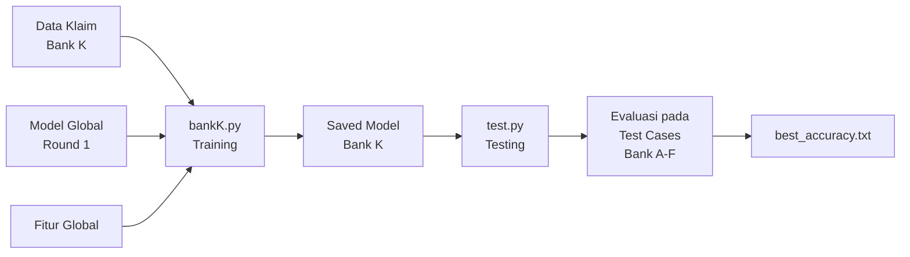

# 🏥 Bank K - Asuransi Jiwa & Kesehatan

## 📋 Deskripsi

**Bank K** merupakan institusi asuransi jiwa dan kesehatan yang berpartisipasi dalam **Federated Learning Iterasi ke-2 (Round 2)**. Sebagai bagian dari round 2, Bank K memanfaatkan **model global dari iterasi pertama** yang telah dilatih menggunakan data dari Bank A-F sebagai base model untuk inisialisasi pembelajaran.

---

## 🎯 Karakteristik Bank K

### Data Non-Transaksi & Informasi Demografis

Bank K memiliki tantangan unik dibandingkan bank-bank lain dalam sistem federated learning ini:

- **Jenis Data**: Bukan data transaksi keuangan, melainkan **data pengajuan klaim asuransi**
- **Fitur Utama**:
  - `customer_age` - Usia nasabah/klien
  - `diagnosis_code` - Kode diagnosa medis

### 🔍 Tantangan

**Data Non-Transaksi & Informasi Demografis**

Bank K menghadapi tantangan spesifik karena data yang dimiliki sangat berbeda dari institusi keuangan lainnya:

1. **Bukan Transaksi Murni**: Data berfokus pada klaim asuransi kesehatan, bukan transaksi finansial seperti transfer atau pembayaran
2. **Sinyal yang Berbeda**: Fitur seperti usia dan kode diagnosa medis memberikan pola yang sangat berbeda dari merchant category, amount, atau location
3. **Domain Knowledge**: Memerlukan pemahaman tentang pola fraud di industri asuransi (klaim palsu, diagnosis fiktif, dll.)

### ⚙️ Implikasi Arsitektur

Keberadaan Bank K dalam federated learning membawa implikasi penting:

> [!IMPORTANT]
> Arsitektur federated learning harus **cukup fleksibel** untuk menangani kasus penggunaan di luar transaksi keuangan murni. Model global perlu belajar dari sinyal yang **sangat berbeda** antar klien.

Hal ini mendemonstrasikan kemampuan federated learning untuk:
- Mengakomodasi **heterogenitas data** yang ekstrem
- Belajar representasi yang **generik** namun tetap **powerful**
- Menangani **domain shift** antara institusi keuangan tradisional dan asuransi

---

## 🚀 Cara Menjalankan Program

### Prasyarat

- Python environment dengan TensorFlow Federated (TFF) terinstal
- WSL (Windows Subsystem for Linux) untuk menjalankan federated learning
- Dataset Bank K tersedia di direktori `data/`
- Model global round 1 tersedia di `models_global_round1/`

### Langkah-langkah Eksekusi

#### 1️⃣ Training Federated Learning (WSL/Environment)

Masuk ke environment atau WSL terlebih dahulu, kemudian jalankan:

```bash
# Masuk ke environment/WSL
source venv/bin/activate  # atau aktivasi environment sesuai setup

# Jalankan training Bank K
python bankK.py
```

**Proses Training:**
- Memuat data klaim asuransi dari Bank K
- Memuat fitur global dari `models_global/fitur_global.pkl`
- Memuat base model dari **Global Round 1** (`models_global_round1/global_savedmodel`)
- Melakukan federated learning dengan membagi data ke beberapa klien lokal
- Menyimpan model hasil training ke `models_round2/saved_bank_K_tff/`

#### 2️⃣ Testing Model Global (Di Luar Environment/WSL)

Setelah training selesai, **keluar dari environment/WSL**, kemudian jalankan:

```bash
# Keluar dari environment (jika di WSL atau venv)
deactivate  # atau exit dari WSL

# Jalankan testing
python test.py
```

**Proses Testing:**
- Memuat model yang telah dilatih dari `models_round2/saved_bank_K_tff/`
- Menguji model terhadap test cases dari semua bank (A-F)
- Menghitung akurasi per bank dan total akurasi
- Menyimpan hasil akurasi terbaik ke `best_accuracy.txt`

---

## 💾 Output Model - Struktur `models_round2\saved_bank_K_tff`

Hasil training dan testing disimpan di direktori `models_round2\saved_bank_K_tff\` dengan struktur sebagai berikut:

### 📁 File-file Utama

| File/Folder | Deskripsi |
|------------|-----------|
| `saved_model.pb` | Model TensorFlow dalam format SavedModel (protobuf binary). File utama yang berisi arsitektur dan bobot model neural network |
| `variables/` | Direktori berisi weight/bobot model dalam format checkpoint TensorFlow |
| `keras_metadata.pb` | Metadata Keras yang menyimpan informasi konfigurasi model |
| `fingerprint.pb` | Fingerprint unik untuk verifikasi integritas model |
| `assets/` | Folder berisi aset tambahan jika ada (biasanya kosong atau berisi file pendukung) |

### 📊 File Training History & Metrics

| File | Deskripsi |
|------|-----------|
| `history_bank_K.json` | Riwayat training lengkap dalam format JSON (loss, accuracy per round/epoch) |
| `accuracy_history.txt` | Log akurasi dalam format teks untuk tracking performa |
| `best_accuracy.txt` | **Akurasi terbaik** hasil evaluasi test.py pada global test cases dari Bank A-F |
| `20260105_145758.npz` | Snapshot checkpoint training pada timestamp tertentu (format NumPy compressed) |

### 🔧 File Preprocessing

| File | Deskripsi |
|------|-----------|
| `preprocess_bank_K.pkl` | Metadata preprocessing Bank K (scaler, feature names, dll.) untuk inference |

### 📂 Folder Checkpoints

| Folder | Deskripsi |
|--------|-----------|
| `ckpt/` | Checkpoint model selama training untuk recovery atau resume training |

---

## 📝 Catatan Penting

> [!NOTE]
> Bank K adalah bagian dari **Round 2 Federated Learning**, yang berarti:
> - Model dimulai dari **base model global Round 1** (hasil kolaborasi Bank A-F)
> - Training di Bank K akan **memperkaya** model global dengan pengetahuan dari domain asuransi
> - Model hasil Bank K dapat di-agregasi dengan bank lain di Round 2 (Bank G-K) untuk membentuk model global Round 2 yang lebih robust

> [!TIP]
> Untuk analisis performa lebih detail, periksa:
> - `history_bank_K.json` untuk melihat kurva learning
> - `accuracy_history.txt` untuk tracking akurasi per iterasi
> - `best_accuracy.txt` untuk melihat performa akhir pada test cases global

---

## 🔄 Alur Federated Learning Bank K



---

## 🌐 Kontribusi ke Model Global

Bank K memberikan kontribusi unik ke model global dengan:

✅ **Diversifikasi domain**: Membawa perspektif non-transaksi (asuransi kesehatan)  
✅ **Fitur demografis**: Menambahkan pola berdasarkan usia dan kondisi medis  
✅ **Generalisasi model**: Memaksa model global untuk belajar representasi yang lebih abstrak dan robust  
✅ **Real-world applicability**: Mendemonstrasikan federated learning untuk berbagai sektor industri

---

**Dibuat untuk Federated Learning Round 2 - Bank K (Asuransi Jiwa & Kesehatan)**
