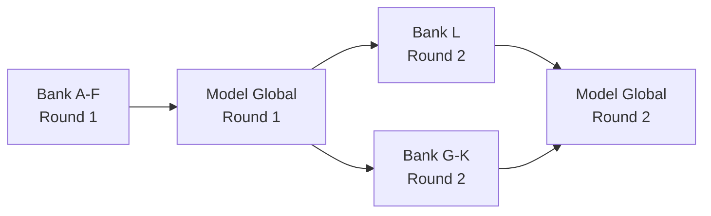

# 🏦 Bank L - Lembaga Microfinance Pedesaan


## 📋 Deskripsi

**Bank L** ("Lembaga Microfinance Pedesaan") merupakan peserta dalam **Federated Learning Iterasi ke-2** untuk sistem deteksi penipuan transaksi keuangan. Bank L menggunakan **model global dari iterasi pertama** (agregasi Bank A-F) sebagai inisialisasi model dasar.

### 🎯 Karakteristik Bank L

| Aspek | Detail |
|-------|--------|
| **Jenis Institusi** | Lembaga Microfinance Pedesaan |
| **Segmen Pasar** | Masyarakat pedesaan, pinjaman mikro |
| **Volume Pinjaman** | Rendah hingga menengah |
| **Fokus Layanan** | Pembiayaan mikro untuk UMKM dan masyarakat rural |

---

## ⚠️ Tantangan Utama: Extreme Class Imbalance

### 🔴 Ketidakseimbangan Kelas Ekstrim

Di lembaga microfinance pedesaan seperti Bank L, kasus penipuan sangat jarang terjadi. Rasio kejadian penipuan sangat rendah:

```
📊 Fraud Rate: ~0.1% (1 dari 1000 pinjaman)
```

### 🧠 Implikasi untuk Model FL

**Masalah:**
- Model cenderung menjadi **"malas"** (lazy classifier)
- Model akan selalu memprediksi **"BUKAN PENIPUAN"** untuk mencapai akurasi tinggi
- Kasus minoritas yang **krusial** (fraud) akan diabaikan oleh model

**Pengujian:**
Eksperimen ini menguji apakah:
1. ✅ Proses agregasi federated learning dapat menangani ketidakseimbangan kelas
2. ✅ Fungsi kerugian (loss function) tetap sensitif terhadap kasus minoritas
3. ✅ Model tidak mengabaikan deteksi penipuan meskipun sangat jarang terjadi

**Solusi yang Diterapkan:**
- Menggunakan **PR-AUC** (Precision-Recall Area Under Curve) sebagai metrik tambahan
- Loss function: **BinaryCrossentropy** yang tetap menghitung error pada kelas minoritas
- Regularisasi L2 untuk mencegah overfitting ke kelas mayoritas
- Dropout layers untuk generalisasi yang lebih baik

---

## 🔄 Federated Learning - Round 2

Bank L merupakan bagian dari **iterasi kedua** federated learning yang menggunakan **model global dari Round 1** (hasil agregasi Bank A-F) sebagai titik awal pembelajaran:



---

## 🚀 Cara Menjalankan

### Tahap 1: Training Model Bank L (`bankL.py`)

#### 1️⃣ Masuk ke Environment

```bash
# Aktivasi virtual environment (jika menggunakan venv)
.\venv\Scripts\activate

# Atau jika menggunakan WSL
source venv/bin/activate
```

#### 2️⃣ Jalankan Training

```bash
# Training dengan konfigurasi default
python bankL.py

# Atau dengan parameter kustom
python bankL.py --n_clients 3 --rounds 10 --batch_size 32 --lr_client 5e-4 --lr_server 1e-3

# Resume training dari checkpoint
python bankL.py --resume
```

**Parameter yang tersedia:**

| Parameter | Default | Deskripsi |
|-----------|---------|-----------|
| `--bank` | `L` | Kode bank |
| `--data_dir` | `data` | Direktori data |
| `--data_file` | Auto | File CSV (default: `bank_L_data_clean.csv`) |
| `--models_dir` | `models_round2` | Direktori output model |
| `--global_dir` | `models_global` | Direktori fitur global |
| `--global_feats` | `fitur_global.pkl` | File fitur global |
| `--global_model_r1` | `models_global_round1/global_savedmodel` | Model global round 1 |
| `--n_clients` | `3` | Jumlah klien federated |
| `--batch_size` | `32` | Ukuran batch |
| `--rounds` | `10` | Jumlah round training |
| `--lr_client` | `5e-4` | Learning rate client optimizer |
| `--lr_server` | `1e-3` | Learning rate server optimizer |
| `--resume` | `False` | Lanjutkan dari checkpoint |

#### 3️⃣ Keluar dari Environment

```bash
# Deaktivasi environment
deactivate

# Jika menggunakan WSL, keluar dari WSL
exit
```

---

### Tahap 2: Testing Model (`test.py`)

> ⚠️ **PENTING**: Jalankan `test.py` di **luar environment/WSL** untuk memastikan kompatibilitas testing.

#### 1️⃣ Jalankan Testing

```bash
# Keluar dari environment terlebih dahulu (jika masih aktif)
deactivate

# Jalankan testing
python test.py
```

**Output yang diharapkan:**
- Hasil prediksi untuk test cases dari Bank A-F
- Akurasi per bank
- Total akurasi keseluruhan
- File `best_accuracy.txt` yang berisi hasil akurasi terbaik

---

## 📦 Struktur Output Model

Hasil training disimpan di direktori:

```
models_round2\saved_bank_L_tff\
```

### 📂 Isi Direktori Saved Model

| File/Folder | Deskripsi |
|-------------|-----------|
| `saved_model.pb` | **Protocol Buffer** - Arsitektur model TensorFlow dalam format binary |
| `keras_metadata.pb` | Metadata Keras untuk kompatibilitas dengan Keras API |
| `fingerprint.pb` | Fingerprint unik untuk versi model |
| **`variables/`** | **Folder weights model** - Berisi bobot dan parameter model terlatih |
| ├─ `variables.data-00000-of-00001` | Data bobot neural network |
| └─ `variables.index` | Index file untuk mapping bobot |
| **`assets/`** | Aset tambahan (jika ada) seperti vocabulary files, dll. |
| **`ckpt/`** | **Checkpoint folder** untuk resume training |
| ├─ `server_state.npz` | State server federated learning (compressed NumPy arrays) |
| └─ `history.json` | Riwayat training per round (acc, pr_auc, loss) |
| `20260105_150040.npz` | **NPZ timestamped** - Bobot model dalam format compressed NumPy array |
| `preprocess_bank_L.pkl` | **Preprocessing metadata** - Konfigurasi preprocessing (NUM_COLS, CAT_COLS, SCALER, dll.) |
| `history_bank_L.json` | Riwayat training lengkap dalam format JSON |
| `accuracy_history.txt` | Log akurasi per round dalam format tab-separated values |
| `best_accuracy.txt` | **Akurasi terbaik** dari evaluasi test cases global |

---

### 📊 Penjelasan Detail File Penting

#### 1. **saved_model.pb** + **variables/**
Format standar TensorFlow SavedModel yang dapat di-load dengan:
```python
import tensorflow as tf
model = tf.keras.models.load_model('models_round2/saved_bank_L_tff')
```

#### 2. **NPZ File** (e.g., `20260105_150040.npz`)
Bobot model dalam format NumPy compressed array, dapat di-load dengan:
```python
import numpy as np
weights = np.load('models_round2/saved_bank_L_tff/20260105_150040.npz')
# Akses weights: weights['arr_0'], weights['arr_1'], ...
```

#### 3. **preprocess_bank_L.pkl**
Metadata preprocessing yang berisi:
- `MODE`: Mode preprocessing (`DICT` atau `LIST`)
- `NUM_COLS`: List kolom numerik
- `CAT_COLS`: List kolom kategorikal
- `HASHER_DIM`: Dimensi feature hashing
- `SCALER`: Scaler object atau dict untuk normalisasi
- `FEATURE_DIM`: Total dimensi fitur setelah preprocessing

#### 4. **Checkpoint Files** (`ckpt/`)
- `server_state.npz`: State server TFF untuk resume training
- `history.json`: Riwayat metrik per round (acc, pr_auc, loss)

#### 5. **History & Accuracy Files**
- `history_bank_L.json`: Riwayat training dalam format JSON struktural
- `accuracy_history.txt`: Tab-separated log dengan format:
  ```
  bank    round   acc     pr_auc  loss    timestamp
  bank_L  1       0.9234  0.8567  0.1234  2026-01-05T15:00:40Z
  ```
- `best_accuracy.txt`: Single value akurasi terbaik dari test cases global

---

## 📈 Monitoring Training

### Metrik yang Dipantau

1. **Binary Accuracy**: Akurasi klasifikasi binary (fraud vs non-fraud)
2. **PR-AUC** (Precision-Recall AUC): Metrik penting untuk imbalanced dataset
3. **Loss**: Binary crossentropy loss

### Contoh Output Training

```
🚀 Training Federated Client (R2): bank_L
📂 Data         : data/bank_L_data_clean.csv
🌐 Fitur Global : models_global/fitur_global.pkl
🌍 Global R1    : models_global_round1/global_savedmodel
💾 Output model : models_round2\saved_bank_L_tff
✅ 10,000 baris, 15 fitur awal
✅ Mode fitur global terdeteksi: DICT
✅ Fitur siap: 128 kolom total
✅ 3 klien federated data siap digunakan.
✅ Base model diinisialisasi dari Global R1 (input_dim=128).

🚀 Mulai Federated Training (ROUND 2) ===========================
[bank_L] Round 01 | acc=0.9234 | pr_auc=0.7845 | loss=0.2145
[bank_L] Round 02 | acc=0.9456 | pr_auc=0.8123 | loss=0.1876
[bank_L] Round 03 | acc=0.9567 | pr_auc=0.8345 | loss=0.1654
...
```

---

## 🔬 Testing & Evaluasi

Testing dilakukan menggunakan **test cases global** dari semua bank (A-F) untuk memastikan model dapat menggeneralisasi dengan baik:

```python
# test.py akan mengevaluasi model terhadap:
# - Bank A test cases (high-volume e-commerce)
# - Bank B test cases (international B2B)
# - Bank C test cases (physical transactions)
# - Bank D test cases (digital loans)
# - Bank E test cases (high-net-worth)
# - Bank F test cases (Sharia banking)
```

**Output:**
- Per-bank accuracy
- Total accuracy
- Confusion matrix style results
- Best accuracy saved to `best_accuracy.txt`

---

## 🛠️ Dependencies

```
tensorflow
tensorflow-federated
pandas
numpy
scikit-learn
joblib
colorama
```

---

## 📝 Catatan Penting

> [!WARNING]
> **Extreme Class Imbalance**
> 
> Model ini dirancang khusus untuk menangani ketidakseimbangan kelas ekstrim. Perhatikan metrik **PR-AUC** lebih dari accuracy biasa, karena PR-AUC lebih sensitif terhadap performa pada kelas minoritas (fraud).

> [!IMPORTANT]
> **Model Global Round 1**
> 
> Bank L menggunakan model global dari Round 1 (Bank A-F) sebagai inisialisasi. Pastikan file `models_global_round1/global_savedmodel` tersedia sebelum training.

> [!TIP]
> **Resume Training**
> 
> Gunakan flag `--resume` untuk melanjutkan training dari checkpoint terakhir jika training terputus.

---

## 📞 Troubleshooting

### ❌ Error: "Data tidak ditemukan"
**Solusi:** Pastikan file `data/bank_L_data_clean.csv` ada di direktori yang benar.

### ❌ Error: "Global R1 tidak ditemukan"
**Solusi:** Model akan tetap berjalan dengan model baru. Untuk menggunakan model global R1, pastikan folder `models_global_round1/global_savedmodel` tersedia.

### ❌ Error: "SCALER tidak ditemukan"
**Solusi:** Pastikan `models_global/fitur_global.pkl` berisi konfigurasi preprocessing yang lengkap dengan key `SCALER`.

### ❌ Model selalu prediksi "0" (non-fraud)
**Solusi:** Ini adalah indikasi class imbalance yang parah. Perhatikan metrik PR-AUC, bukan hanya accuracy. Model mungkin perlu:
- Learning rate yang lebih rendah
- Lebih banyak rounds
- Class weights atau resampling

---
