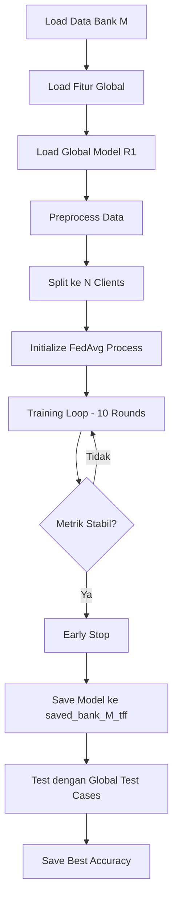

# 🏦 Bank M - Payment Gateway Global

## 📋 Deskripsi

**Bank M** merupakan **Payment Gateway Global** yang berpartisipasi dalam **Federated Learning Iterasi Ke-2**. Bank M menggunakan model global dari iterasi pertama (Bank A-F) sebagai model dasar (base model) untuk meningkatkan performa deteksi fraud.

---

## 🎯 Karakteristik Bank M

### **Jenis Institusi**: Payment Gateway Global

Bank M beroperasi sebagai payment gateway global yang memproses transaksi dalam volume tinggi dan frekuensi ekstrem tinggi.

### **Tantangan Utama**: Data Time-Series & Dimensi Tinggi

#### 📊 Karakteristik Data

- **Transaksi Real-time**: Transaksi terjadi setiap detik dengan volume yang sangat besar
- **Fitur Turunan Kompleks**: Data menyertakan fitur-fitur yang dihitung dari histori transaksi, seperti:
  - `avg_amount_7d` → Rata-rata jumlah transaksi nasabah dalam 7 hari terakhir
  - `time_since_last_tx_sec` → Waktu sejak transaksi terakhir (dalam detik)
- **Dimensi Tinggi**: Banyak fitur yang bergantung pada waktu dan pola transaksi historis

#### ⚙️ Implikasi untuk Federated Learning

> [!IMPORTANT]
> Sistem harus mampu memproses dan belajar dari fitur-fitur yang **bergantung pada waktu (time-dependent features)**.

**Pre-processing di Node Client** menjadi lebih kompleks karena:

1. **Bukan Hanya Pembersihan Data**: Pre-processing tidak hanya melakukan data cleaning standar
2. **Kalkulasi Berbasis Histori**: Sistem harus melakukan perhitungan fitur agregat berdasarkan histori transaksi nasabah
3. **Feature Engineering Real-time**: Fitur seperti rata-rata tranaksi 7 hari terakhir dan interval waktu transaksi harus dihitung di sisi client sebelum federated training
4. **Kompleksitas Temporal**: Model harus dapat menangani temporal dependencies dan time-series patterns

---

## 🚀 Cara Menjalankan

### **Tahap 1: Training Model dengan Federated Learning**

1. **Masuk ke Environment/WSL**
   ```bash
   # Aktivasi virtual environment
   source venv/bin/activate  # Linux/WSL
   # atau
   venv\Scripts\activate     # Windows
   ```

2. **Jalankan Training Script**
   ```bash
   python bankM.py
   ```

   **Parameter Opsional**:
   ```bash
   python bankM.py \
     --bank M \
     --n_clients 3 \
     --batch_size 32 \
     --rounds 10 \
     --lr_client 5e-4 \
     --lr_server 1e-3 \
     --resume
   ```

   Parameter yang tersedia:
   - `--bank`: Kode bank (default: M)
   - `--data_dir`: Direktori data (default: data)
   - `--data_file`: Override nama file CSV
   - `--models_dir`: Direktori output model (default: models_round2)
   - `--global_dir`: Direktori fitur global (default: models_global)
   - `--global_feats`: File fitur global (default: fitur_global.pkl)
   - `--global_model_r1`: Path model global round 1 (default: models_global_round1/global_savedmodel)
   - `--n_clients`: Jumlah klien federated (default: 3)
   - `--batch_size`: Ukuran batch (default: 32)
   - `--rounds`: Jumlah round training (default: 10)
   - `--lr_client`: Learning rate client (default: 5e-4)
   - `--lr_server`: Learning rate server (default: 1e-3)
   - `--resume`: Flag untuk melanjutkan dari checkpoint

3. **Deaktivasi Environment**
   ```bash
   deactivate
   ```

---

### **Tahap 2: Testing Model**

1. **Keluar dari Environment/WSL** (jika masih dalam environment)

2. **Jalankan Testing Script**
   ```bash
   python test.py
   ```

   Script ini akan:
   - Load model dari `models_round2\saved_bank_M_tff`
   - Menguji model terhadap test cases dari Bank A-F
   - Menghitung akurasi per bank dan total accuracy
   - Menyimpan hasil ke `best_accuracy.txt`

---

## 📦 Isi Saved Model

Model hasil training disimpan di direktori: **`models_round2\saved_bank_M_tff`**

Berikut adalah struktur dan penjelasan isi dari saved model:

### 📂 Struktur Direktori

```
models_round2/saved_bank_M_tff/
├── saved_model.pb                    # Protocol Buffer model (SavedModel format)
├── keras_metadata.pb                 # Metadata Keras model
├── fingerprint.pb                    # Fingerprint untuk version tracking
├── variables/                        # Folder berisi bobot model
│   ├── variables.data-00000-of-00001 # Data bobot neural network
│   └── variables.index               # Index file untuk bobot
├── assets/                           # Folder untuk aset tambahan (jika ada)
├── ckpt/                            # Checkpoint folder untuk resume training
│   ├── server_state.npz             # State server federated learning
│   └── history.json                 # History metrics per round
├── 20260105_150649.npz              # Bobot model dalam format NPZ (timestamped)
├── preprocess_bank_M.pkl            # Metadata preprocessing (scaler, feature columns, dll)
├── history_bank_M.json              # History training lengkap (acc, pr_auc, loss per round)
├── accuracy_history.txt             # Log akurasi dalam format tabel
└── best_accuracy.txt                # Akurasi terbaik dari testing
```

---

### 📄 Penjelasan File-File Penting

#### 1. **saved_model.pb** (122 KB)
- **Format**: TensorFlow SavedModel
- **Isi**: Arsitektur lengkap model neural network dalam Protocol Buffer format
- **Kegunaan**: Dapat di-load langsung dengan `tf.keras.models.load_model()` untuk inference

#### 2. **variables/** (Directory)
- **Isi**: Bobot (weights) dan bias dari semua layer dalam neural network
- **Format**: TensorFlow checkpoint format
- **Kegunaan**: Menyimpan parameter model yang telah dilatih

#### 3. **keras_metadata.pb** (12 KB)
- **Isi**: Metadata tentang arsitektur Keras (layer config, optimizer, dll)
- **Kegunaan**: Membantu TensorFlow merekonstruksi model dengan benar

#### 4. **ckpt/server_state.npz**
- **Isi**: State server dari federated learning (bobot agregasi)
- **Kegunaan**: Untuk resume training jika dihentikan di tengah jalan
- **Format**: NumPy compressed array dengan key `w_0`, `w_1`, ..., `w_n`

#### 5. **ckpt/history.json**
- **Isi**: Metrik training per round (accuracy, PR-AUC, loss)
- **Kegunaan**: Tracking progres training untuk analisis konvergensi

#### 6. **20260105_150649.npz** (51 KB)
- **Format**: NumPy compressed array
- **Isi**: Snapshot bobot model dengan timestamp
- **Kegunaan**: Backup bobot model dalam format ringan dan portable

#### 7. **preprocess_bank_M.pkl** (1 KB)
- **Format**: Python pickle (joblib)
- **Isi**: Metadata preprocessing yang mencakup:
  - `MODE`: "DICT" atau "LIST" (mode fitur global)
  - `NUM_COLS`: Kolom numerik yang digunakan
  - `CAT_COLS`: Kolom kategorikal yang di-hash
  - `HASHER_DIM`: Dimensi feature hashing
  - `SCALER`: MinMax scaler atau dict dengan `data_min_` dan `data_range_`
  - `FEATURE_DIM`: Jumlah total fitur setelah preprocessing
- **Kegunaan**: Untuk memastikan preprocessing test data sama persis dengan training data

#### 8. **history_bank_M.json**
- **Format**: JSON
- **Isi**: Array of objects dengan struktur:
  ```json
  [
    {
      "round": 1,
      "acc": 0.9523,
      "pr_auc": 0.8765,
      "loss": 0.1234
    },
    ...
  ]
  ```
- **Kegunaan**: Visualisasi learning curve dan analisis performa

#### 9. **accuracy_history.txt**
- **Format**: Tab-separated values (TSV)
- **Isi**: Log akurasi dengan timestamp
  ```
  bank    round   acc       pr_auc    loss      timestamp
  bank_M  1       0.952300  0.876500  0.123400  2026-01-05T15:06:49Z
  bank_M  2       0.961200  0.891200  0.089300  2026-01-05T15:06:51Z
  ...
  ```
- **Kegunaan**: Audit trail dan monitoring performa model

#### 10. **best_accuracy.txt**
- **Format**: Plain text
- **Isi**: Single value akurasi terbaik dari global test (contoh: `0.950000`)
- **Kegunaan**: Quick reference untuk performa model terhadap test cases global

---

## 🔬 Detail Teknis

### **Arsitektur Model**

```python
Input (FEATURE_DIM)
    ↓
BatchNormalization
    ↓
Dense(128, activation='relu', L2=1e-4)
    ↓
Dropout(0.30)
    ↓
Dense(64, activation='relu', L2=1e-4)
    ↓
Dropout(0.20)
    ↓
Dense(1, activation='sigmoid')  # Output: fraud probability
```

### **Preprocessing Pipeline**

1. **Load Fitur Global**: Dari `models_global/fitur_global.pkl`
2. **Mode Detection**: Deteksi apakah format DICT atau LIST
3. **Numeric Features**: 
   - Clean dengan regex untuk hapus karakter non-numerik
   - Scale menggunakan MinMaxScaler dari model global
4. **Categorical Features**: 
   - Feature hashing dengan dimensi sesuai global config
   - Alternatif: One-hot encoding lalu align dengan feature list global
5. **Concatenation**: Gabung numeric + categorical menjadi vektor final

### **Federated Learning Configuration**

- **Algorithm**: Weighted FedAvg (Federated Averaging)
- **Client Optimizer**: Adam (lr=5e-4)
- **Server Optimizer**: Adam (lr=1e-3)
- **Loss Function**: Binary Cross-Entropy
- **Metrics**: Binary Accuracy, PR-AUC
- **Base Model**: Initialized from Global Round 1 (`models_global_round1/global_savedmodel`)

---

## 📊 Metrics & Evaluation

Model dievaluasi menggunakan:

1. **Binary Accuracy**: Proporsi prediksi yang benar
2. **PR-AUC (Precision-Recall Area Under Curve)**: Metrik untuk imbalanced dataset
3. **Loss**: Binary cross-entropy loss

Testing dilakukan terhadap test cases dari **6 bank** (Bank A-F) untuk memastikan generalisasi model.

---

## 🔄 Workflow Federated Learning Round 2



---

## ⚠️ Catatan Penting

> [!WARNING]
> **Pre-processing Dependency**: Pastikan file `models_global/fitur_global.pkl` tersedia dan sesuai dengan format yang diharapkan (DICT atau LIST).

> [!IMPORTANT]
> **Global Model R1**: Model akan mencoba load base model dari `models_global_round1/global_savedmodel`. Jika tidak ditemukan atau dimensi tidak cocok, akan menggunakan model baru.

> [!TIP]
> **Resume Training**: Gunakan flag `--resume` untuk melanjutkan training dari checkpoint terakhir jika training terputus.

---
