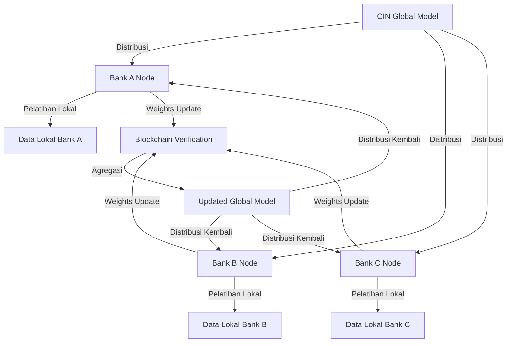

# CIN - Collaborative Intelligence Network

Platform B2B untuk kolaborasi intelijen ancaman (threat intelligence) berbasis Federated Learning dan Blockchain.

## 🎯 Visi & Misi

**Visi:**  
Menciptakan ekosistem keuangan yang paling cerdas dan aman di Asia Tenggara dengan memungkinkan kolaborasi intelijen ancaman tanpa mengorbankan privasi data.

**Misi:**  
Membangun platform B2B pertama yang menggunakan Federated Learning dan Blockchain untuk memungkinkan institusi keuangan secara kolektif memerangi penipuan dan risiko kredit, sambil mematuhi regulasi kerahasiaan data yang paling ketat.

**Elevator Pitch:**  
*"CIN adalah aliansi intelijen di mana bank dapat melatih model AI mereka dengan wawasan dari seluruh industri tanpa pernah berbagi data nasabah, semuanya diamankan dan diaudit oleh teknologi blockchain."*

---

## 🔥 Masalah yang Diselesaikan

Industri keuangan menghadapi dilema kritis:

- **Ancaman Berkembang:** Serangan penipuan semakin terkoordinasi dan canggih, menargetkan beberapa institusi secara simultan
- **Data Terisolasi (Siloed Data):** Setiap institusi hanya memiliki pandangan terbatas, melatih model AI pada data internal yang tidak lengkap
- **Hambatan Regulasi:** Berbagi data mentah untuk melatih model secara terpusat adalah ilegal, mahal, dan berisiko tinggi secara hukum dan reputasi

Akibatnya, industri keuangan selalu reaktif, menderita kerugian triliunan rupiah setiap tahun, dan membebankan biaya tersebut kepada konsumen.

---

## 💡 Solusi: Platform CIN

CIN adalah platform berbasis keanggotaan yang menyediakan infrastruktur untuk pelatihan model AI kolaboratif yang menjaga privasi.

### Cara Kerja



### Tahapan Proses

1. **Node Aman**  
   Anggota (bank/fintech) menginstal software CIN Node di dalam lingkungan aman mereka sendiri

2. **Pelatihan Lokal**  
   Model AI global dari CIN dikirim ke setiap Node untuk dilatih dengan data transaksi lokal milik anggota. **Data tidak pernah keluar dari server mereka**

3. **Pembaruan Terverifikasi**  
   Hanya pembaruan model (weights) yang dikirim kembali. Hash (sidik jari digital) dari pembaruan ini dicatat di blockchain sebagai bukti integritas yang tidak dapat diubah

4. **Agregasi Cerdas**  
   Weights dari semua anggota digabungkan untuk menciptakan versi model global baru yang lebih cerdas dan akurat

5. **Distribusi Intelijen**  
   Model global yang telah ditingkatkan didistribusikan kembali ke semua anggota, memberi mereka kemampuan prediktif yang superior

---

## 📁 Struktur Proyek

```
CIN/
├── BankA-N/           # Node simulasi untuk 14 institusi keuangan berbeda
├── DATASET/           # Dataset transaksi untuk pelatihan
├── federated_server/  # Server agregasi federated learning
└── KUMPULAN MODEL A-N/# Model hasil pelatihan dari setiap bank
```

---

## 🏦 Anggota Institusi Simulasi

Proyek ini mensimulasikan 14 institusi keuangan dengan karakteristik berbeda:

- **Bank A-F:** Bank tradisional dengan segmentasi berbeda (retail, corporate, UMKM, wealth management, dll)
- **Bank G:** Bank dengan sistem legacy dan tantangan data quality
- **Bank H:** Challenger bank digital dengan exclusive features
- **Bank I:** Bank dengan sistem sederhana dan concept drift
- **Bank J:** Stock & crypto broker dengan high cardinality data
- **Bank K:** Asuransi jiwa & kesehatan dengan non-transactional data
- **Bank L:** Payment gateway global dengan time-series data
- **Bank M:** Microfinance dengan extreme class imbalance
- **Bank N:** Bank dengan encrypted data untuk advanced privacy

---

## 🔐 Keamanan & Privasi

- ✅ Data nasabah **tidak pernah** meninggalkan server lokal institusi
- ✅ Hanya model weights yang dibagikan
- ✅ Setiap update diverifikasi dengan blockchain
- ✅ Audit trail yang transparan dan immutable
- ✅ Compliance dengan regulasi kerahasiaan data

---

## 🚀 Teknologi Utama

- **Federated Learning:** TensorFlow Federated (TFF)
- **Blockchain:** Untuk verifikasi dan audit trail
- **Machine Learning:** Model deteksi fraud berbasis neural network
- **Privacy-Preserving ML:** Differential privacy dan secure aggregation

---

## 📊 Manfaat

- 🎯 **Akurasi Lebih Tinggi:** Model dilatih dengan wawasan dari seluruh industri
- 🔒 **Privasi Terjaga:** Data sensitif tidak pernah dibagikan
- ⚖️ **Compliance:** Memenuhi regulasi perlindungan data
- 💰 **Efisiensi Biaya:** Mengurangi kerugian akibat fraud secara kolektif
- 🤝 **Kolaborasi Industri:** Institusi bersaing dapat bekerja sama tanpa risiko

---
